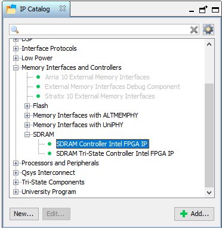
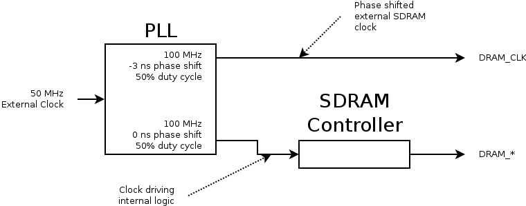

# DRAM

The easiest and least messy way of interfacing with the DRAM (that avoids 
writing a custom DRAM controller) is to instantiate the `SDRAM Controller Intel FPGA IP`
component offered by Quartus' Platform Designer (formerly known as QSYS).

## SDRAM Controller Instantiation

The `SDRAM Controller Intel FPGA IP` is available in Platform Designer in all
versions of Quartus (that is, it is available in the free "Lite" edition,
so one would think it should be available in more expensive versions
of the software.)



The parameters for the Memory Profile and Timing that worked for me are
given in the table below. I was able to find all the data for the SDRAM
timing from the datasheet for the device except for `t_wr`. I just left
that at the default `14 ns` and it seemed to work. If you know how
to get the actual value for this from the datasheet, let me know!

### Memory Profile

| Parameter      | Value     |
|----------------|-----------|
| Bits           | 16        |
| Chip select    | 1         |
| Banks          | 4         |
| Rows           | 13        |
| Columns        | 10        |

### Timing

| Parameter                       | Setting   |
|---------------------------------|-----------|
| CAS Latency                     | 2         |
| Initialization refresh cycles   | 8         |
| Issue one refresh every         | 7.8125 ns |
| Delay after powerup             | 100 us    |
| `t_rfc`                         | 55 ns     |
| `t_rp`                          | 15 ns     |
| `t_rcd`                         | 15 ns     |
| `t_ac`                          | 6 ns      |
| `t_wr`                          | 14 ns     |

## Clocking
The SDRAM controller (and SDRAM itself ... wouldn't really make much
sense to clock the two at different frequencies ... ) should be clocked with a 
```
100 MHz
```
clock. What is a little less obvious is that the external clock should be
phase shifted by
```
-3 ns
```
to accomodate for signal propogation delay. Both of these signals can be
generated from the available `50 MHz` clock using a PLL. An overview
of this scheme is summarized in the figure below.



## IO Timing Constraints
To ensure the DRAM control signals more or less arrive at the same time,
the DRAM IO pins should be timing constrained. An `example.sdc` file
is included in this REPO to illustrate timing constraints that have
worked well for me personally. This is largely based on the reference
design provided by Terasic, and uses the signal names generated by
System Builder for the DE10 Lite.

## Using the SDRAM Controller
The Intel SDRAM controller supports the [Avalon](https://www.intel.com/content/www/us/en/programmable/documentation/nik1412467993397.html)
interface. To gain access to the controller, another Avalon compatible component
can be used.

If a simpler interface is desired, something like the (PDF WARNING)
[External Bus to Avalon Bridge](https://people.ece.cornell.edu/land/courses/ece5760/DE1_SOC/External_Bus_to_Avalon_Bridge.pdf)
can be used.

*Pro-tip:* If using the External Bus to Avalon Bridge, configuring the
parallel data out width to larger values (like 128 bits) can greatly
speed up the through put of the SDRAM -> Avalon -> Bridge connection
as fewer transactions have to be made (and I suspect greater use
of burst reads, though that is just speculation).
